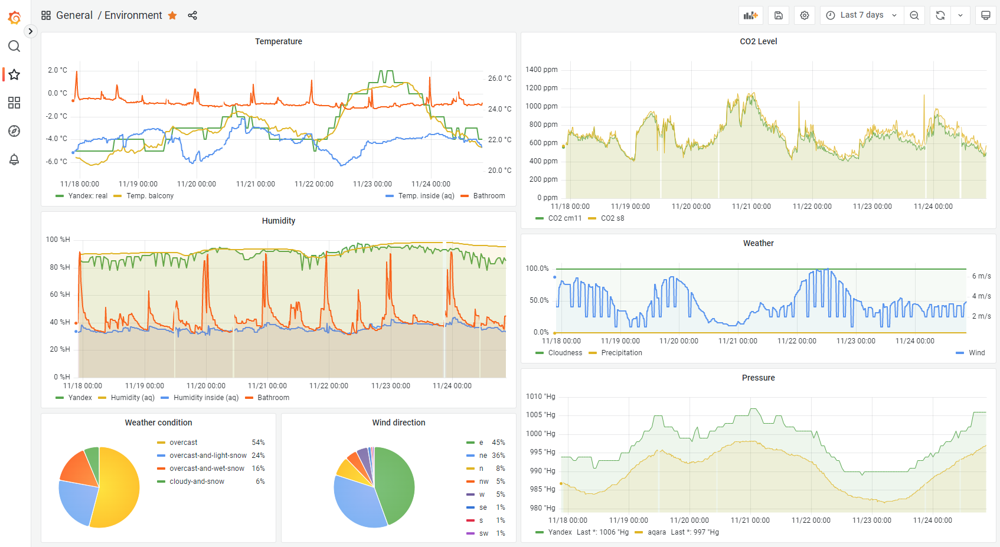

## Disclaimer
> this project strongly depends on custom external sensors, so it won't work for you without heavy modifications
# Home station for rpi
**Features**:
* **LED Panel clock**
  * actually, the only real goal of this project
  * 

    
picture of device

    
      https://user-images.githubusercontent.com/14160356/206857211-8d43333a-2a5c-4fe0-a5b3-7af17c93118c.mp4
    

* **Sensors**
  * current inside tempreature/humidity/CO2 level
  * current outside tempreature/humidity/pressure/light
  * current weather conditions (precipitations, wind speed, etc) provided by yandex.weather
  * weather forecast for next day
* **Sensors collector**
  aggregates data from: 
  * custom esp8266 sensors via mqtt
  * zigbee sensors via zigbee2mqtt
  * r4s devices
* **Prometheus exporter**
  

  
grafana screenshot

  
   
 
 

  

[**Project structure**](contents.md)
*** 
**Big thanks to**:
* https://github.com/hzeller/rpi-rgb-led-matrix

*** 
**External tools**
* home assistant
* zigbee2mqtt
* memcached
* mosquitto
* grafana
* prometheus
* ESP32 r4sGate

